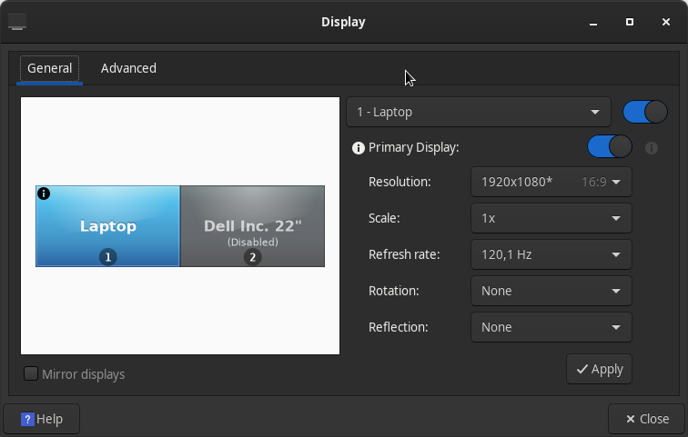

# NVIDIA Primary Graphics Card Config
Originally created as a fix for a gaming laptop with an AMD Integrated GPU and a second NVIDIA GPU that handled the HDMI port. After plugging an HDMI cable into the port, the external monitor would get recognized, but would just display a "No Signal" error. In the display settings, the monitor would be recognized, but would appear as "disabled":


After testing out a common fix using the [nvidia-xconfig](https://download.nvidia.com/XFree86/Linux-x86_64/340.108/README/editxconfig.html) utility which yielded undesirable results (now *only* the external monitor worked and the laptop screen was always black), I found this config that made everything work properly. The monitor now gets recognized when plugged in and works right away.

Use the `glxinfo | egrep "OpenGL vendor|OpenGL renderer"` command to check your primary GPU. If it's not your NVIDIA GPU (assuming that's the one that handles the HDMI port), it might be the reason behind the 'No Signal' error. For example, this was my output, showing the AMD integrated GPU (yours can be different):
```
OpenGL vendor string: AMD
OpenGL renderer string: AMD Radeon Vega 10 Graphics (RAVEN, DRM 3.42.0, 5.15.19-1-MANJARO, LLVM 13.0.0)
```

## Using the config

To change the primary GPU to the NVIDIA card, copy the `nvidia.conf` from this repository into the `/etc/X11/xorg.conf.d` folder. If there already is a `nvidia.conf` there, back it up just in case you need to go back.

Restart your computer and check `glxinfo | egrep "OpenGL vendor|OpenGL renderer"` again. It should dispaly the name of your NVIDIA GPU now. For example:
```
OpenGL vendor string: NVIDIA Corporation
OpenGL renderer string: NVIDIA GeForce GTX 1650/PCIe/SSE2
```